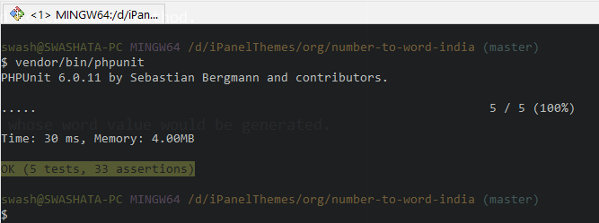

# Number to Words PHP Class - Indian Version

[](https://travis-ci.org/swashata/php-number-to-word-india) [](https://codeclimate.com/github/swashata/php-number-to-word-india) [](https://codeclimate.com/github/swashata/php-number-to-word-india/coverage) [](https://codeclimate.com/github/swashata/php-number-to-word-india)

This class converts numbers to Indian-English Words. Works for all kinds of
numbers including floats. A few examples.

## Examples

* `10,000,00` - **Ten Lakh**
* `3,478` - **Three Thousand Four Hundred And Seventy Eight**
* `1,234,567,890` - **One Hundred And Twenty Three Crore Forty Five Lakh Sixty Seven Thousand Eight Hundred And Ninty**
* `5,024.78` - **Five Thousand Twenty Four And 78/100**

## Installation

### Using Composer

Navigate to your project directory and execute

`composer require ntwindia/ntwindia`

If you haven't already, include the composer `autoload.php` file.

```php
require_once 'vendor/autoload.php';
```

### Manual Installation

**Clone this repository using git**

```bash
git clone git@github.com:swashata/php-number-to-word-india.git
```

**Include the class**

```php
<?php
require_once 'src/NTWIndia.php';
require_once 'src/Exception/NTWIndiaInvalidNumber.php';
require_once 'src/Exception/NTWIndiaNumberOverflow.php';
```

## Usage

**Create an instance**

```php
<?php
$ntw = new \NTWIndia\NTWIndia();
```

**Convert values**

```php
<?php
echo $ntw->numToWord( 3104007200 );
// Will print Three Hundred Ten Crore Forty Lakh Seven Thousand Two Hundred
```

If your number is always less than 100, then use `numToWordSmall` method to
reduce memory usage.

```php
<?php
echo $ntw->numToWordSmall( 99 );
// Will print Ninty Nine
```

## Methods

Two methods are available

### `numToWord`

Converts any number to word including decimal values. Decimals are converted as
`... And 986/1000`. You will mostly need to call this method.

#### Parameters

* `$number`: *integer|float* The number whose word value would be generated.

#### Return

Returns `string` The word value of the number. All of the words have uppercased
first letter.

### `numToWordSmall`

Converts numbers smaller than 100 into words. If the number is greater than 99
then it simply calls `numToWord`.

Use this when you know your number is lesser than 100 to reduce memory usage.

#### Parameters

* `$number`: *integer* The number whose word value would be generated. It does
 not accepts floating values and will convert to integer if given.

#### Return

Returns `string` The word value of the number. All of the words have uppercased
first letter.

## Exception Handling

Two exceptions are thrown depending on the condition.

### `\NTWIndia\Exception\NTWIndiaInvalidNumber`

If you pass a variable to a method which isn't a valid number `( ! is_numeric( $number ) )`

### `\NTWIndia\Exception\NTWIndiaNumberOverflow`

If pass a number which exceeds the limit.

* For `numToWord` it is the `PHP_MAX_INT`.
* For `numToWordSmall` it is `99`.

## Translation

To translate, kindly replace the public variables:

* `$hundred`: Hundred word. Defaults *'Hundred'*.
* `$thousand`: Thousand word. Defaults *'Thousand'*.
* `$lakh`: Lakh word. Defaults *'Lakh'*.
* `$crore`: Crore word. Defaults *'Crore'*.
* `$and`: And word. Defaults *'And'*.
* `$numToWord`: Contains mapping of numbers to words. From `0` to `20` and multiple
 of `10` upto `90`.

## Unit Test

Unit test is available through composer.

```bash
$ cd /path/to/php-number-to-word-india/
$ composer update
$ vendor/bin/phpunit
```

It will output something like this.



You are more than welcome to add more test cases and send me a pull request.

Kindly follow [Contribution Guide](CONTRIBUTING.md)

## License

PHP Number to Word in Indian Style is licensed under GPLv3

    Copyright (C) 2017  Swashata Ghosh

    This program is free software: you can redistribute it and/or modify
    it under the terms of the GNU General Public License as published by
    the Free Software Foundation, either version 3 of the License, or
    (at your option) any later version.

    This program is distributed in the hope that it will be useful,
    but WITHOUT ANY WARRANTY; without even the implied warranty of
    MERCHANTABILITY or FITNESS FOR A PARTICULAR PURPOSE.  See the
    GNU General Public License for more details.

    You should have received a copy of the GNU General Public License
    along with this program.  If not, see <http://www.gnu.org/licenses/>
